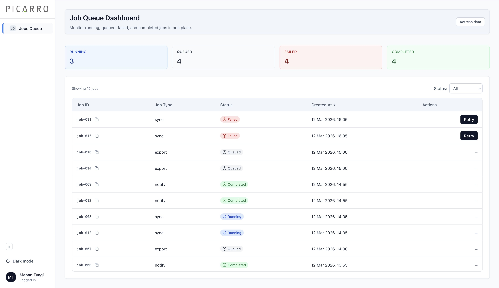
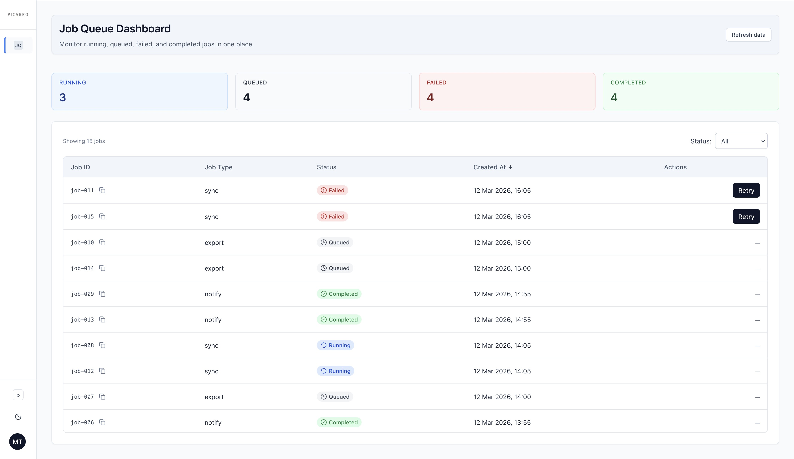
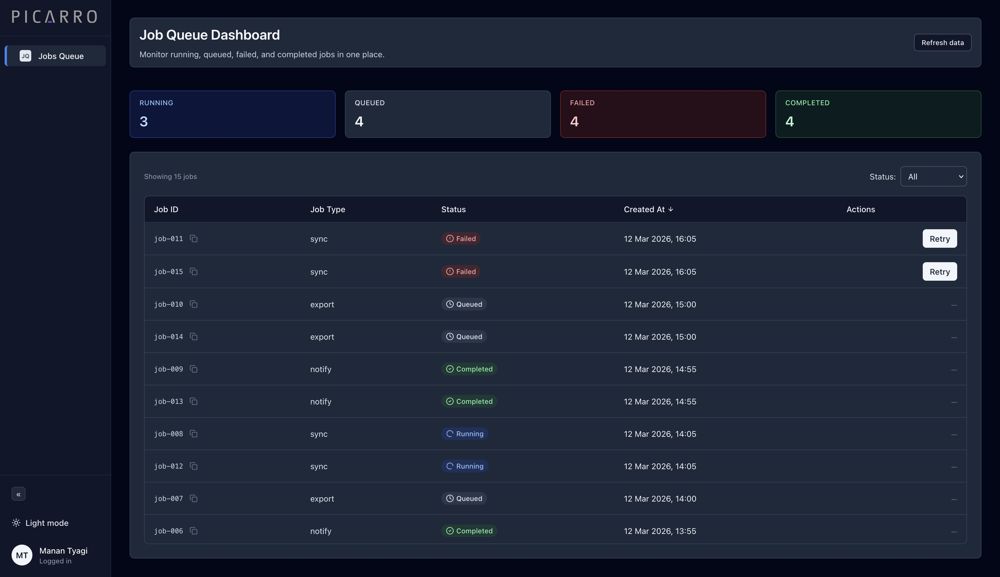
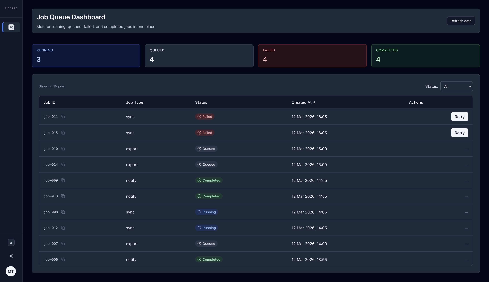

# Job Queue Dashboard

A React + TypeScript dashboard for operations and SRE teams to monitor background job queues, retry failed jobs without engineering intervention, and view at-a-glance status—with dark mode and a mock API.

---

## Overview

The **Job Queue Dashboard** gives operations and SRE users a single place to see running, queued, failed, and completed jobs. It addresses the need to quickly assess queue health, identify failures, and retry them without switching tools or involving engineers. The UI is built for clarity and speed: status badges, filters, sortable columns, one-click retry with clear feedback (toasts and row highlight), and summary cards for quick visibility.

---

## Screenshots

### Dashboard Expanded in Light Mode



### Dashboard Collapsed in Light Mode



### Dashboard Expanded in Dark Mode



### Dashboard Collapsed in Dark Mode



---

## Live Demo

**Live demo:** [https://picarro-job-queue-dashboard.vercel.app/](https://picarro-job-queue-dashboard.vercel.app/)

## Features

- View background jobs in a sortable table
- Filter jobs by status
- Retry failed jobs
- Summary cards for quick status overview
- Copy job ID to clipboard
- Skeleton loading state
- Row highlight on retry
- Dark mode support
- Mock API with Next.js routes

## Tech Stack

| Layer | Choice |
|-------|--------|
| **UI** | React 18, TypeScript, Next.js 14 (App Router) |
| **Styling** | Tailwind CSS, Lucide React, next-themes (dark/light) |
| **Server state** | TanStack React Query (fetch, cache, cache updates on retry) |
| **Backend** | Next.js API routes + in-memory mock (`/api/jobs`, `/api/jobs/:id/retry`) |
| **Dates** | Native `Date#toLocaleString` via `src/utils/date.ts` (no date-fns) |
| **Testing** | Vitest, React Testing Library, jsdom |

---

## Architecture

### Server state vs UI state

- **Server state** — The job list is the single source of truth in React Query (`queryKey: ["jobs"]`). It is fetched via `getJobs`, refetched on “Refresh data” and on initial-load “Retry.” After a successful retry, the mutation’s `onSuccess` updates the cache with `queryClient.setQueryData`, replacing only the retried job with the updated one (status → `Queued`). The table and summary cards re-render from this cache, so the UI reflects the new state without a full refetch.
- **UI state** — Status filter, Created At sort direction, toast, highlighted job ID, and load-retry count live in React `useState` on the page. Filtering and sorting are derived in a `useMemo` from `jobsQuery.data`; they are not stored on the server.


### Guiding Principles

The implementation prioritizes clear separation of server and UI state, predictable data flow, and responsive user feedback so that operations users can quickly understand job status and safely retry failures without ambiguity.

### Hooks and services

- **`useJobs()`** (`src/hooks/useJobs.ts`) — Encapsulates `useQuery` (jobs list) and `useMutation` (retry). Keeps server state and retry logic in one place and simplifies the page.
- **`jobsService`** (`src/services/jobsService.ts`) — Thin layer over `fetch` for `GET /api/jobs` and `POST /api/jobs/:id/retry`. Keeps API URLs and response handling out of components.

### Component composition

The main jobs page composes layout (header, summary, filters, table area) and owns all UI state. It delegates job list rendering to `JobTable`, which receives filtered/sorted data and callbacks. Presentational pieces (badges, filter dropdown, summary cards, skeleton) are separate components so they stay modular and testable.

### How retry updates reach the UI

1. User clicks Retry → `retryMutation.mutate(id)`.
2. `retryJob(id)` calls `POST /api/jobs/:id/retry`; mock updates the job to `Queued` and returns it.
3. Mutation `onSuccess` runs: `queryClient.setQueryData(["jobs"], ...)` updates the cached list in place.
4. React Query triggers a re-render; the page’s `filteredJobs` (from `useMemo`) now include the updated job.
5. Page sets success toast and `highlightedJobId`; after 1.2s the highlight clears. The row shows “Queued” and the Retry button is no longer shown.

---

## Component Architecture

| Component | Responsibility | Modularity |
|-----------|----------------|------------|
| **JobTable** | Renders the jobs table: columns (Job ID with copy, Type, Status, Created At, Actions). Handles sort toggle, retry loading state per row, and highlighted row styling. Uses `JobStatusBadge` for status and an inline Retry button for failed jobs. | Receives `jobs`, callbacks, and UI state as props; no data fetching. |
| **JobStatusBadge** | Renders a status pill with semantic color and icon (e.g. Running + spinner, Failed + alert, Completed + check). | Pure presentational; single prop `status`. |
| **JobStatusFilter** | Dropdown to filter by status (All, Running, Queued, Failed, Completed). | Controlled component: `value` + `onChange`. |
| **JobStatusSummary** | Four summary cards (Running, Queued, Failed, Completed) with counts derived from the job list. | Pure presentational; accepts `jobs` and computes counts internally. |
| **JobTableSkeleton** | Table-shaped skeleton with 6 placeholder rows and pulse animation during initial load. | Reuses same table structure as `JobTable` for visual consistency. |
| **Sidebar** | App shell: logo, nav (Jobs Queue), collapse/expand, theme toggle. | Layout-only; no job logic. |
| **Spinner** | Small loading indicator (sm/md) used in Retry button and elsewhere. | Reusable UI primitive. |

There is no separate `JobRow` component; rows are rendered inside `JobTable` to keep the table and its behavior (retry, highlight, copy) in one place while still delegating status display to `JobStatusBadge`.

---

## State Management

- **Server data** — Fetched with `useQuery({ queryKey: ["jobs"], queryFn: getJobs })`. Refetched via “Refresh data” and on initial-load “Retry.” No polling or WebSockets in the current scope.
- **Filtering and sorting** — Applied client-side in a `useMemo`: filter by `statusFilter`, then sort by `createdAt` (asc/desc). This keeps the implementation simple and avoids backend changes; see Tradeoffs for limits.
- **Retry mutation** — `useMutation` with `mutationFn: retryJob`. On success, the cache is updated in place so the list and summary cards stay in sync without a refetch.
- **Toast and highlight** — Local state; toast auto-clears after 3s, highlight after 1.2s. Custom implementation (no toast library) to keep dependencies minimal and behavior explicit.

---

## Design & UX Decisions

- **Status color coding** — Running (blue), Queued (gray), Failed (red), Completed (green) with matching dark-mode variants. Aligns with common mental models and improves quick scanning.
- **Skeleton loading** — Table-shaped skeleton during initial fetch to avoid layout shift and signal that a table is loading.
- **Disabled retry during mutation** — Retry button shows a spinner and is disabled while the request is in flight to prevent double submissions and give clear feedback.
- **Summary cards** — Four cards above the table for quick status visibility without scrolling or filtering.
- **Row highlight on retry success** — Short green highlight on the retried row reinforces which job was queued for retry.
- **Subtle animations** — Row hover and highlight use `transition-colors duration-300`; Running badge uses a slow spin for “in progress.”
- **Dark mode** — next-themes with class-based strategy; full dark styling for table, cards, sidebar, and toasts so the app is usable in low-light environments.

---

## API Mocking

The backend is implemented with **Next.js API routes** (Pages Router) and an in-memory store:

- **`src/mocks/jobs.ts`** — Exports mutable `MOCK_JOBS` and `updateJobStatus(id, status)`. Retry sets status to `"Queued"` and returns the updated job.
- **GET /api/jobs** — Returns the full job list (200) or 405 for non-GET.
- **POST /api/jobs/:id/retry** — Updates the job to Queued, returns the job (200), or 404/400 for not found or missing id; 405 for non-POST.

The app uses relative URLs, so the same process serves both UI and API in development and production build.

---

## AI Workflow

AI tools were used as a development assistant for scaffolding, component structure, design decision making and tests.

### Tools used and their purpose
1. **ChatGPT**: 
    - For converting PRD into easy to breakdown tasks
    - For generating detailed prompts for the tasks created in the step above to pass on to Cursor
    - For iterating on design
    - For deciding additional UI/UX features for making the app more usable beyond the basic scope of the PRD
    - For generating initial version of `README.md` and iterating on it
2. **Cursor**: 
    - For initial scaffolding of the project with Next.js, Tailwind CSS, React Query, APIs, next-themes and icons library
    - For generating components required by the project
    - For solving bugs
    - For generating tests for a couple of components

### Where they accelerated work
- Initial Next.js + React Query setup
- Tailwind and component markup
- Test structure for `JobStatusBadge` and `JobStatusFilter`
- Setting up dark mode option


### Manual engineering decisions included
- Using Next.js API routes instead of MSW for the mock (simpler for a single full-stack app)
- Centralizing server state in a single `useJobs` hook
- Implementing cache updates on retry instead of refetch-only
- Choosing a custom toast and row highlight instead of a third-party toast library.

 The README and architecture were refined by hand to reflect actual code and tradeoffs.
 
 
 ### Overview of some prompts used
 1. Set up a new project with Typescript and Next.js. Scaffold all files needed for this. Also, set up a git repo for this project along with react query for my app
 
 2. Reorganise the codebase such that default route is the jobs page. Remove the page.tsx from app folder.
 
 3. Create a clean internal dashboard UI design system for a React + TypeScript + Tailwind application called "Job Queue Dashboard".
    Design philosophy:
    - clean
    - minimal
    - internal SRE / ops tool style
    - information dense but readable
    - neutral palette
    
    Global page layout:
    - background: slate-50
    - page padding: 32px
    - centered container max width: 1100px
    
    Typography:
    - page title: text-2xl font-semibold text-slate-900
    - table headers: text-sm font-medium text-slate-600
    - table body text: text-sm text-slate-800
    - metadata text: text-xs text-slate-500
    - job id: font-mono text-xs
    
    Card style:
    - background: white
    - border: border-slate-200
    - border radius: rounded-lg
    - shadow: shadow-sm
    - padding: p-6
    
    Table style:
    - wrapper: border border-slate-200 rounded-lg overflow-hidden
    - header background: bg-slate-100
    - row border: border-t border-slate-200
    - row hover: hover:bg-slate-50
    - cell padding: px-4 py-3
    - align text left
    
    Status badge component:
    - base style: px-2 py-1 text-xs font-medium rounded-full
    
    Status colors:
    Running:
    - bg-blue-100
    - text-blue-700
    
    Queued:
    - bg-gray-100
    - text-gray-700
    
    Failed:
    - bg-red-100
    - text-red-700
    
    Completed:
    - bg-green-100
    - text-green-700
    
    Retry button style:
    - px-3 py-1.5
    - text-sm font-medium
    - rounded-md
    - bg-slate-900
    - text-white
    - hover:bg-slate-700
    - transition-colors
    
    Disabled button:
    - bg-slate-300
    - text-white
    - cursor-not-allowed
    
    Dropdown filter style:
    - border border-slate-300
    - rounded-md
    - px-3 py-2
    - text-sm
    - bg-white
    - focus:ring-2 focus:ring-blue-500
    - focus:outline-none
    
    Spinner style:
    - animate-spin
    - rounded-full
    - h-5 w-5
    - border-b-2 border-slate-900
    
    Toast styles:
    Success toast:
    - bg-green-50
    - text-green-800
    - border border-green-200
    
    Error toast:
    - bg-red-50
    - text-red-800
    - border border-red-200
    
    Empty state style:
    - text-center
    - py-12
    - text-slate-500
    
    Spacing rules:
    - section spacing: mb-6
    - card spacing: p-6
    - table padding: px-4 py-3

    Ensure consistent Tailwind styling across all components. Use TypeScript types. Do not include inline styles.
    Make these changes in individual CSS files, so if you are styling jobtable, create a new jobtable.css in styles folder and it should only contain the styles for that component, unless something is being shared among other components

4. Add tests for a couple of components

5. The current home page looks very basic, let's add a sidepanel. It should be collapsible, have a image on top of the panel to show client logo (the image can be added later, so put a placeholder here), and bottom of the panel should show user's avatar, use first chars of their initials for this, and name. Hovering over it should show logout option (which won't work, just make it visual). Within panel, below the logo, add option of Jobs Queue and make it selected. Selection could be in a shade of blue color. Make it same as job card hover color. Every such option should have an icon and a name, and on collapse it should only show the icon and hovering on icon should show name of the option in a tooltip

6. At the top of the dashboard, let's add a component for showing counts of each job type. Like this:
        --------------------------------------------
        Running | Queued | Failed | Completed
        2       | 3      | 1      | 4
        --------------------------------------------
    Each type can be a card, and use color scheme for each card like the ones defined in table itself.
7. In the sidepanel, towards the bottom, add an option for toggling dark mode for the entire app. let's try to implement a dark mode version for the app

---

## Tradeoffs

- **Mock API vs real backend** — In-memory mock keeps the project self-contained and easy to run; swapping to a real API is a matter of changing `jobsService` and optionally adding auth/env config.
- **Client-side filtering and sorting** — Simple and correct for small lists; for very large datasets, server-side filtering, sorting, and pagination would be needed.
- **Cache update vs refetch on retry** — Cache is updated in place so the UI updates immediately and stays consistent with the mutation response; a refetch could be used instead for stronger consistency with the server at the cost of an extra request and possible flash.
- **No pagination** — In scope, the list is small enough to render in one view; pagination or virtualization would be a natural next step for larger lists.
- **Single retry at a time** — The UI disables retry while a mutation is pending (and the implementation could be extended to limit concurrency) to avoid overlapping retries and unclear feedback.

---

## Future Improvements

- **Pagination or virtualization** — For large lists, add cursor-based or page-based pagination, or virtualize the table to keep DOM and render cost low.
- **Real-time updates** — Polling or WebSockets so the dashboard reflects new or updated jobs without manual refresh.
- **Job detail view** — Expand or modal with full job payload, history, and logs for debugging.
- **Observability** — Logging and metrics for retries and errors; optional correlation with backend tracing.
- **Accessibility** — ARIA labels, keyboard navigation, focus management for toasts and retry, and screen-reader-friendly status announcements.
- **Retry feedback** — Optional “Queued for retry” or similar state in the row until the next refresh or event.

---

## Running the Project

```bash
npm install
npm run dev
```

Open [http://localhost:3000](http://localhost:3000).

Production build:

```bash
npm run build
npm run start
```

---

## Testing

Vitest + React Testing Library; `@` alias points to `src`.

- **JobStatusBadge** — Renders correct label and status-specific class for Running, Queued, Failed, Completed.
- **JobStatusFilter** — Renders all options and calls `onChange` with the selected value.

Run tests:

```bash
npm test
```

---

## Deployment

**Vercel:** Connect the repo, use the default Next.js preset. Build: `npm run build`, output: `.next`. No environment variables required for the current mock API.
